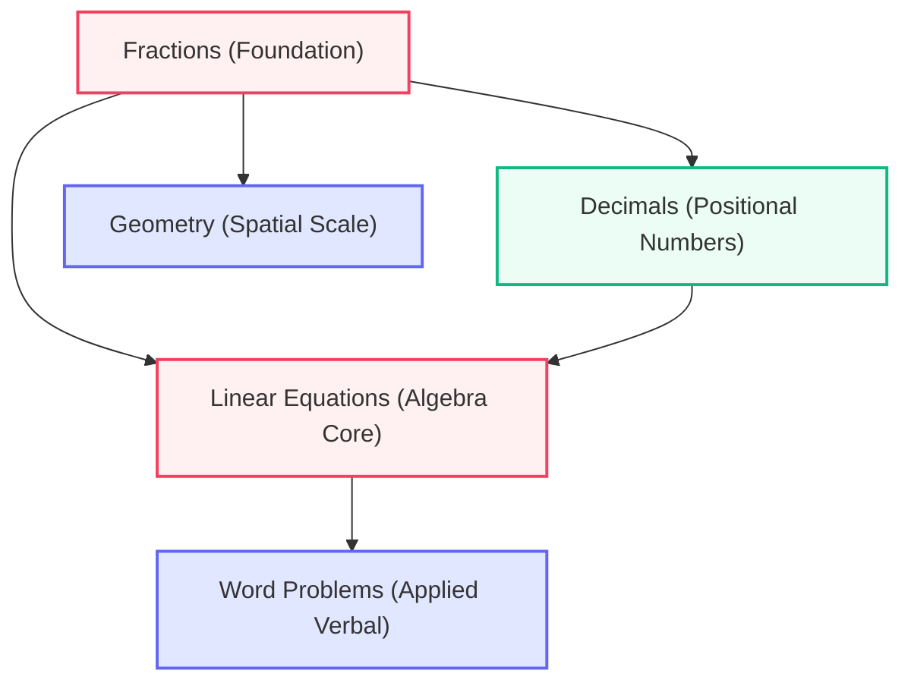

<div align="center">

# The Cognitive Learning Twin Agent 🧠

*A dynamic, cooperative digital twin modeling how students learn, forget, and progress in real-time.*
</div>

---
## URL : https://cognitive-learning-twin-976470733496.asia-southeast1.run.app/

## 📖 Project Overview

Traditional education metrics focus heavily on grades and quiz percentages. However, these static scores fail to reveal how a student is actually thinking, why they hit specific hurdles, or when they are about to forget formulas.

**The Cognitive Learning Twin** resolves this by modeling a student's cognitive state as a dynamic digital twin. It continuously tracks:
- **Conceptual Mastery:** Real-time understanding of math concepts.
- **Memory Decay Rates:** Predicts exactly when a student is likely to forget a topic.
- **Prerequisite Dependencies:** Identifies the root cause of learning bottlenecks (e.g., struggling with Algebra because the foundation of Fractions is weak).

---

## 🛠️ Architecture & Core Features

The system consists of three main modules: the **Interactive Knowledge Graph**, the **Left Sidebar Metrics Panel**, and the **Right-side Cooperative Agents Panel**.

### 1. Interactive Knowledge Graph
The center screen visualizes the student's learning pathways and prerequisite dependencies. Rather than delivering generic worksheets, the graph illuminates root gaps. For example, if a student struggles in Algebra, the graph exposes that the core bottleneck originates in Fractions, letting educators or the AI tutor rebuild foundational concepts first.



### 2. Cooperative Assistant Agents
The main Cognitive Twin coordinates with three specialized helper agents on the right panel to customize learning resources:
* **The Retention Agent (Spaced Repetition):** Audits memory decay intervals. It uses an active Leitner recall deck to test memory retention at perfect intervals so concepts transition into long-term memory.
* **The Skill Transfer Agent (Cross-Domain Analogy):** Bridges abstract math into familiar real-world domains. If a student loves music or physics, it translates fractional ratios into guitar chord signature meters, recipe splits, or liquid displacement scales.
* **The Accessibility Agent (Interface Customization):** Provides user overrides to counter cognitive overload. Users can instantly switch on high-contrast views, dyslexic-friendly fonts, wide character spacing, and simplified language structures.

### 3. Dynamic Practice & Real-time Updates
The **Practice Quiz** module checks the student's mastery interactively. Answering diagnostic questions correctly (e.g., equivalent fractions conversions) dynamically increases the student's mastery level in that topic (adding +15%), updates the knowledge graph, and shifts focus toward next-level topics.

---

## ⚙️ Interactive Modes & How to Use

### 👥 Student Presets
The application loads four preset student profiles to showcase varying conceptual states and stalling risks:
| Preset Profile ID | Pace | Stalling Risk | Diagnostic Focus |
| :--- | :--- | :--- | :--- |
| **Demo Student** | Steady | Moderate | Prerequisite Fractions bottleneck blocking Linear Algebra progress. |
| **Struggling** | Struggling | High | Multiple concurrent gaps in basic arithmetic and decimals. |
| **Transitioning** | Intermittent | Low | Transitioning from basic arithmetic to intermediate Algebra. |
| **Advanced** | Accelerated | Low | Close to unlocking advanced high-school level word problems. |

### 🔄 What-If Simulator
Using the **What-If Simulator** tab in the sidebar, educators can:
1. Adjust individual concept masteries using ranges from 0% to 100%.
2. See the recommendation engine recalculate focal areas instantly.
3. Export and copy the raw [Schema JSON Specification](file:///d:/Kowid%20Dev/twin-repo/src/components/SidebarMetrics.tsx#L277-L309) payload to integrate with enterprise Learning Management Systems (LMS).

---

## 🚀 Installation & Setup

### Prerequisites
- **Node.js** (v18+ recommended)
- **Gemini API Key** (Optional. If the API key is not configured, the application falls back to localized pedagogical companion simulations.)

### Getting Started

1. **Install Dependencies:**
   ```bash
   npm install
   ```

2. **Configure Environment Variables:**
   Create a `.env.local` file in the root directory (based on `.env.example`) and add your Gemini API key:
   ```env
   GEMINI_API_KEY=your_gemini_api_key_here
   ```

3. **Run the Application:**
   ```bash
   npm run dev
   ```

4. **View in Browser:**
   Open [http://localhost:5173](http://localhost:5173) in your browser.

---

## 📂 Codebase Reference Directory

- **[src/App.tsx](file:///d:/Kowid%20Dev/twin-repo/src/App.tsx)**: Main application logic, preset handler states, and panel state coordination.
- **[src/components/CognitiveGraph.tsx](file:///d:/Kowid%20Dev/twin-repo/src/components/CognitiveGraph.tsx)**: Coordinates SVG layout pathways, node drawing, and mastery-based status coloring.
- **[src/components/SidebarMetrics.tsx](file:///d:/Kowid%20Dev/twin-repo/src/components/SidebarMetrics.tsx)**: Displays the mastery matrix, Feldern-Silverman learning style vectors, and the What-If simulation slider fields.
- **[src/components/AgentPanel.tsx](file:///d:/Kowid%20Dev/twin-repo/src/components/AgentPanel.tsx)**: Implements spaced repetition flashcards, analogy translation mapping, and accessibility switches.
- **[src/data/presetData.ts](file:///d:/Kowid%20Dev/twin-repo/src/data/presetData.ts)**: Topic definitions, prerequisite path structures, student presets, and default Leitner cards.
- **[src/types.ts](file:///d:/Kowid%20Dev/twin-repo/src/types.ts)**: Shared TypeScript structures for profiles, agents, advisor recommendations, and topic states.
